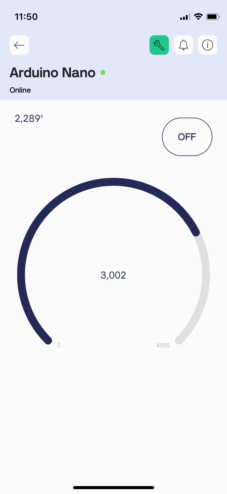
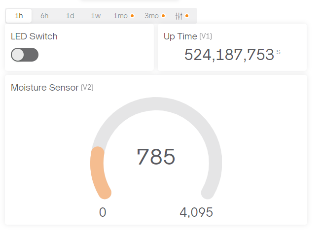
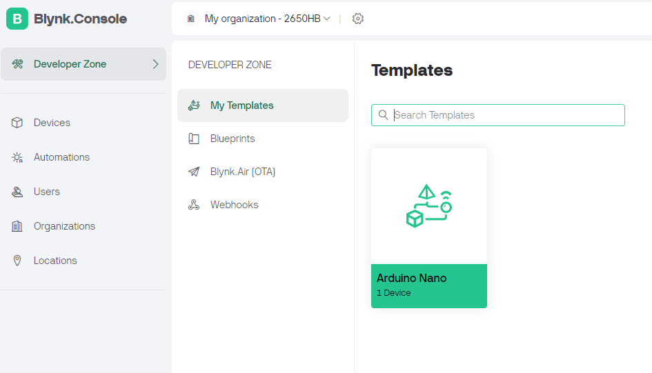

# Wireless Moisture Sensor Mobile App

Created a wireless moisture sensor which updates the moisture level on a IOS/Andriod Blynk App.  This was achieved using the [Arduino Nano ESP32](https://docs.arduino.cc/tutorials/nano-esp32/cheat-sheet/) development board and [Blynk.io](https://blynk.io/) mobile app.

Created a Template for Ardunino Nano ESP32 board

